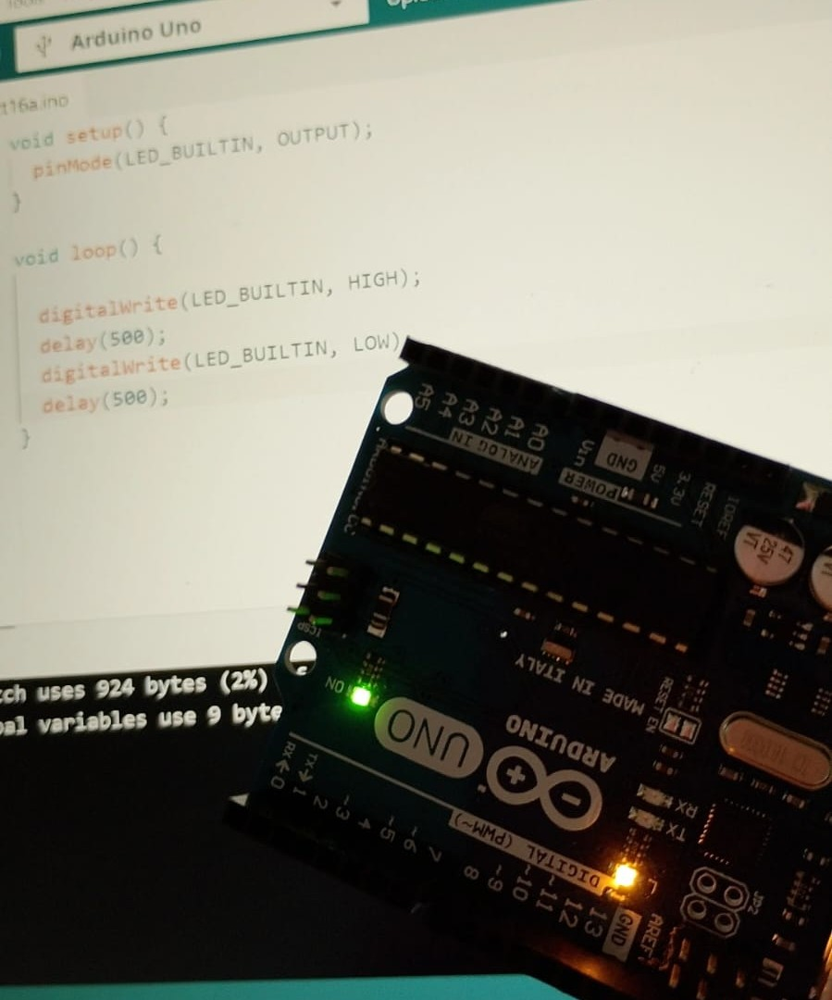
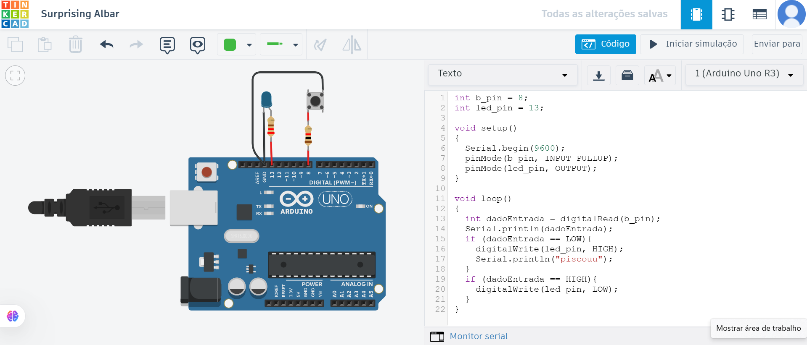

# Atividade Ponderada da Primeira Semana do Módulo 4 do Inteli

## Parte 1: Blink Led Interno
Segue abaixo o código desenvolvido para piscar o led interno do arduíno, assim como a imagem e o link para o vídeo do projeto funcionando:

```
void setup() {
  pinMode(LED_BUILTIN, OUTPUT);
}

void loop() {

  digitalWrite(LED_BUILTIN, HIGH);
  delay(500); 
  digitalWrite(LED_BUILTIN, LOW);
  delay(500); 
}
```
*Obs: o código comentado encontra-se no arquivo primeiraparte.ino deste repositório.*

### Vídeo Demonstrativo:
[Acesse aqui o vídeo demonstrativo!](https://drive.google.com/file/d/1GIKWm-4iPIYcjyZSOCRo2RSh_9S6yd0y/view?usp=drive_link)

<p align = "center">Figura 2 - Blink Led Intero<p>
<div align = "center">
  
 <sup>Fonte: material autoral.</sup>
 </div>

---

## Parte 2: Blink Led Externo

Segue abaixo o código desenvolvido para piscar o led externo do arduíno, assim como a imagem e o link para o vídeo do projeto funcionando no TinkerCad:

*Obs: faz-se necessário observar que, embora a atividade demande apenas o piscar do LED, adicionei um push bottom com o fito de ir além.*

```
int b_pin = 8;
int led_pin = 13;

void setup()
{
  Serial.begin(9600);
  pinMode(b_pin, INPUT_PULLUP);
  pinMode(led_pin, OUTPUT);
}

void loop()
{
  int dadoEntrada = digitalRead(b_pin);
  Serial.println(dadoEntrada);
  if (dadoEntrada == LOW){
    digitalWrite(led_pin, HIGH);
    Serial.println("piscouu");
  }
  if (dadoEntrada == HIGH){
    digitalWrite(led_pin, LOW);
  }
}
```
*Obs: o código comentado encontra-se no arquivo segundaparte.ino deste repositório.*

### Vídeo Demonstrativo:
[Acesse aqui o vídeo demonstrativo!](https://drive.google.com/file/d/1GIKWm-4iPIYcjyZSOCRo2RSh_9S6yd0y/view?usp=drive_link)

<p align = "center">Figura 2 - Blink Led Externo</p>
<div align = "center">
  
 <sup>Fonte: material autoral.</sup>
 </div>


